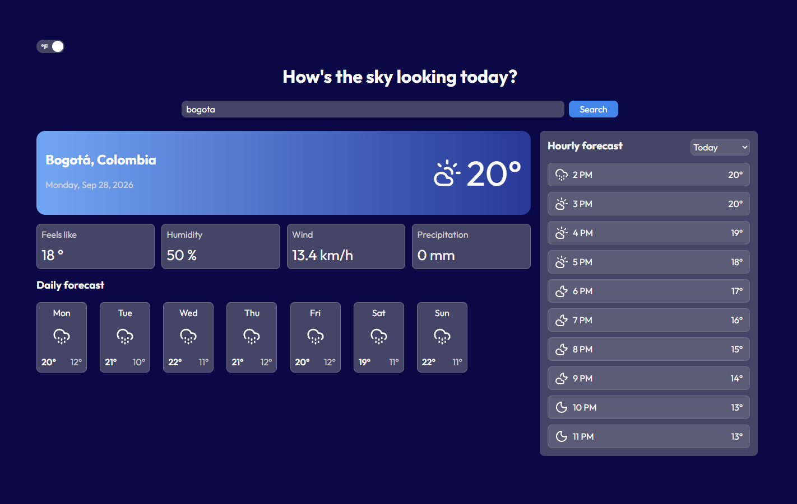
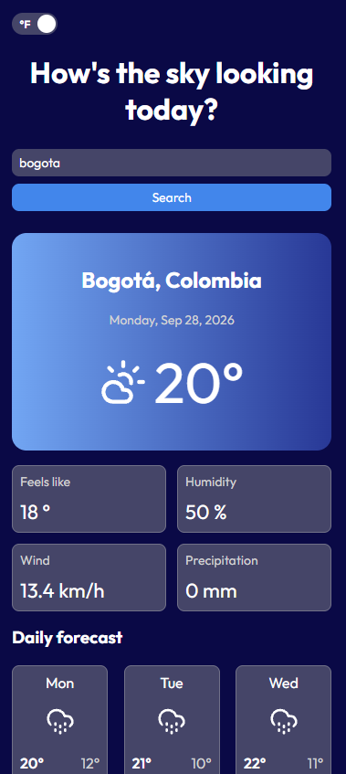
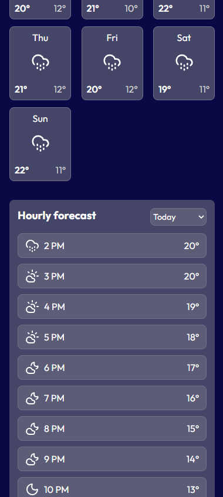

# Weather App

A responsive weather application built with React that allows users to search for a city and view current weather conditions, hourly forecasts, and daily forecasts.

## Features
- Search for a city and view its current weather.
- Display current temperature and feels-like temperature.
- Display humidity, wind speed, and precipitation.
- View the hourly forecast.
- View the daily forecast.
- Switch between Celsius and Fahrenheit.
- Responsive design for desktop and mobile devices.
- Dynamic weather icons based on weather conditions and time of day.

## Technologies
- React
- JavaScript
- CSS Modules
- Vite
- Open-Meteo API

## Screenshots

### Desktop

### Mobile

